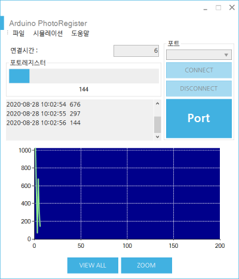

# ArduinoMonitoring
아두이노 모니터링 앱 
</img>

## 사용기술
> * [C#(.NET Framework 4.7.2)](https://dotnet.microsoft.com/download/dotnet-framework/net472)
> * [Windows Forms App](https://docs.microsoft.com/ko-kr/visualstudio/designers/windows-forms-designer-overview?view=vs-2019)
> * [Basic USB to Serial](https://www.arduino.cc/reference/ko/language/functions/communication/serial/)
> * [MySQL.Data library](https://dev.mysql.com/doc/connector-net/en/connector-net-tutorials.html)
> * [MetroSet UI(MetroFramework)](https://thielj.github.io/MetroFramework/)
> * [LiveCharts](https://lvcharts.net/)

###### [이전](https://github.com/hugoMGSung/StudyIoT)
